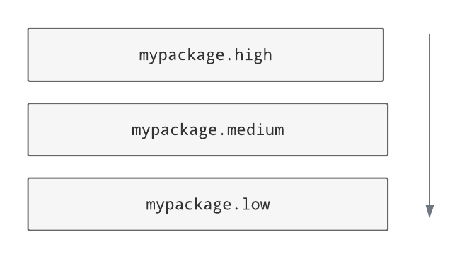
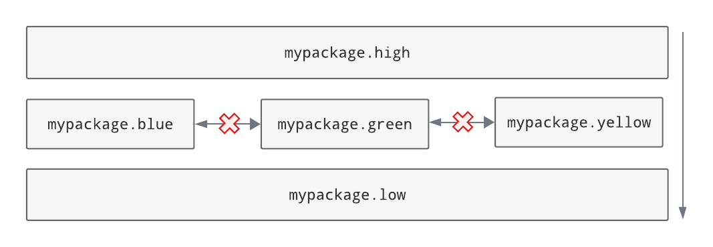
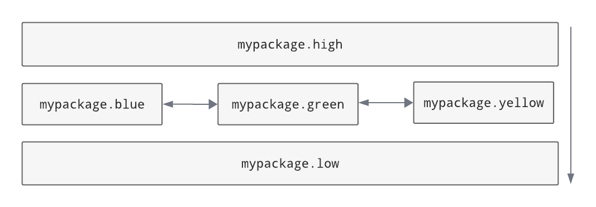

## Layers

*Type name:* `layers`

Layers contracts enforce a 'layered architecture', where higher layers may depend on lower layers, but not the other
way around.

**Configuration options**

- `layers`:
  An ordered list with the name of each layer module. If `containers` are specified too, then these names must be
  *relative to the container*. The order is from higher to lower level layers. Layers wrapped in parentheses
  (e.g. `(foo)`) will be ignored if they are not present in the file system; otherwise, the contract will fail.
  It's also possible to include multiple layer modules on the same line, separated by either exclusively pipes
  (`|`) or exclusively colons (`:`) - see [Multi-item layers](#multi-item-layers). Does not support [wildcards](index.md#wildcards).
- `containers`:
  List of the parent modules of the layers, as *absolute names* that you could import, such as
  `mypackage.foo`. See [Containers](#containers). Supports [wildcards](index.md#wildcards). (Optional.)
- `ignore_imports`: See [shared options](index.md#options-used-by-multiple-contracts).
- `unmatched_ignore_imports_alerting`: See [shared options](index.md#options-used-by-multiple-contracts).
- `exhaustive`. If true, check that the contract declares every possible layer in its list of layers to check.
  See [Exhaustive contracts](#exhaustive-contracts). (Optional, default False.)
- `exhaustive_ignores`. A list of layers to ignore in exhaustiveness checks. (Optional.)

### Basic usage

'Layers' is a software architecture pattern in which a list of modules/packages have a dependency direction
from high to low.



In this diagram, the Python package `mypackage` has a layered architecture in which its subpackage `high` is the
highest layer and its subpackage `low` is the lowest layer. `low` is not allowed to import from any of the layers
above it, while `high` can import from everything. In the middle, `medium` can import from `low` but not `high`.
This includes indirect imports (i.e. chains of imports via other modules), so if there was a module not listed here that
imports `high` (say, `utils`) then `low` wouldn't be allowed to import that either.

The architecture is enforced for all modules within the layers, too, so `mypackage.low.one` would not be
allowed to import from `mypackage.high.two`. That said, the layers don't have to be subpackages - they could just be
individual `.py` modules.

Here's how the architecture shown above could be checked using a `layers` contract:

=== "INI"
    
    ```ini
    [importlinter:contract:my-layers-contract]
    name = My layers contract
    type = layers
    layers =
        mypackage.high
        mypackage.medium
        mypackage.low
    ```

=== "TOML"
    ```toml
    [[tool.importlinter.contracts]]
    name = "My layers contract"
    type = "layers"
    layers = [
        "mypackage.high",
        "mypackage.medium",
        "mypackage.low",
    ]
    ```

If a layer is listed in the contract, the contract will be broken if the layer doesn't exist. You can make a layer
optional by wrapping it in parentheses, but this is only likely to be useful if you are using
[containers](#containers).

### Layering across root packages

Layers don't have to be subpackages - they can be top-level (root) packages. We can still layer a Python project
consisting of three packages `high`, `medium` and `low`, in a directory that does not contain an
`__init__.py` file:

=== "INI"
    ```ini
    [importlinter]
    root_packages=
        high
        medium
        low

    [importlinter:contract:my-layers-contract]
    name = My three-tier layers contract (multiple root packages)
    type = layers
    layers =
        high
        medium
        low
    ```

=== "TOML"
    ```toml
    [tool.importlinter]
    root_packages = [
        "high",
        "medium",
        "low",
    ]

    [[tool.importlinter.contracts]]
    name = "My three-tier layers contract (multiple root packages)"
    type = "layers"
    layers = [
        "high",
        "medium",
        "low",
    ]
    ```

In this contract, each top level package is treated as a layer. (Note, though, that they all need to be specified
as `root_packages` in the `[importlinter]` configuration, too.)

### Containers

Containers allow for a less repetitive way of specifying layers.

Here's a contract that layers `mypackage.high`, `mypackage.medium` and `mypackage.low` using a single container:

=== "INI"
    ```ini
    [importlinter:contract:my-layers-contract]
    name = My layers contract
    type = layers
    layers =
        high
        medium
        low
    containers =
        mypackage
    ```

=== "TOML"
    ```toml
    [[tool.importlinter.contracts]]
    name = "My layers contract"
    type = "layers"
    layers = [
        "high",
        "medium",
        "low",
    ]
    containers = [
        "mypackage",
    ]
    ```

Note that by using a container, we don't need to repeat the containing package in the `layers` section.

Containers are particularly useful if you want to specify a recurring pattern of layers in different places in the graph:

=== "INI"
    ```ini
    [importlinter:contract:my-layers-contract]
    name = My multiple package layers contract
    type = layers
    layers =
        high
        (medium)
        low
    containers =
        mypackage.foo
        mypackage.bar
        mypackage.baz
    ```

=== "TOML"
    ```toml
    [[tool.importlinter.contracts]]
    name = "My multiple package layers contract"
    type = "layers"
    layers = [
        "high",
        "(medium)",
        "low",
    ]
    containers = [
        "mypackage.foo",
        "mypackage.bar",
        "mypackage.baz",
    ]
    ```

In this example, each container has its own layered architecture. For example, it will not allow `mypackage.foo.low`
to import `mypackage.foo.high`. However, it will allow `mypackage.foo.low` to import `mypackage.bar.high`,
as they are in different containers:

Notice that `medium` is wrapped in parentheses, making it an optional layer. This means that if it is missing from any of
the containers, Import Linter won't complain.

### Exhaustive contracts

If you want to make sure that *every* module in each container is defined as a layer, you can mark the contract as
'exhaustive'. This means that if a module is added to the code base in the same package as your layers, the contract
will fail. Any such modules that shouldn't cause a failure can be added to an `exhaustive_ignores` list.

=== "INI"
    ```ini
    [importlinter:contract:my-layers-contract]
    name = My multiple package layers contract
    type = layers
    layers =
      high
      (medium)
      low
    containers=
      mypackage.foo
      mypackage.bar
      mypackage.baz
    exhaustive = true
    exhaustive_ignores =
      utils
    ```

=== "TOML"
    ```toml
    [[tool.importlinter.contracts]]
    name = "My multiple package layers contract"
    type = "layers"
    layers = [
        "high",
        "(medium)",
        "low",
    ]
    containers = [
        "mypackage.foo",
        "mypackage.bar",
        "mypackage.baz",
    ]
    exhaustive = true
    exhaustive_ignores = [
        "utils",
    ]
    ```

If, say, a module existed called `mypackage.foo.extra`, the contract will fail as it is not listed as a layer. However
`mypackage.foo.utils` would be allowed as it is listed in `exhaustive_ignores`.

Exhaustive contracts are only supported for layers that define containers.

### Multi-item layers

Import Linter supports the presence of multiple sibling modules or packages within the same layer. In the diagram below,
the modules `blue`, `green` and `yellow` are 'independent' in the same layer. This means that, in addition to not
being allowed to import from layers above them, they are not allowed to import from each other.



An architecture like this can be checked by listing the siblings on the same line, separated by pipe characters:

=== "INI"
    ```ini
    [importlinter:contract:my-layers-contract]
    name = Contract with sibling modules (independent)
    type = layers
    layers =
      mypackage.high
      mypackage.blue | mypackage.green | mypackage.yellow
      mypackage.low
    ```

=== "TOML"
    ```toml
    [[tool.importlinter.contracts]]
    name = "Contract with sibling modules (independent)"
    type = "layers"
    layers = [
        "mypackage.high",
        "mypackage.blue | mypackage.green | mypackage.yellow",
        "mypackage.low",
    ]
    ```

For a more relaxed architecture siblings can be designated as non-independent, meaning that they are allowed to import
from each other, as shown:



To allow siblings to depend on each other, use colons instead of pipes to separate them:

=== "INI"
    ```ini
    [importlinter:contract:my-layers-contract]
    name = Contract with sibling modules (independent)
    type = layers
    layers =
      mypackage.high
      mypackage.blue : mypackage.green : mypackage.yellow
      mypackage.low
    ```

=== "TOML"
    ```toml
    [[tool.importlinter.contracts]]
    name = "Contract with sibling modules (independent)"
    type = "layers"
    layers = [
        "mypackage.high",
        "mypackage.blue : mypackage.green : mypackage.yellow",
        "mypackage.low",
    ]
    ```

Note: you are not allowed to mix different kinds of separators on the same line. This would be an invalid contract:

=== "INI"
    ```ini
    [importlinter:contract:my-invalid-contract]
    name = Invalid contract
    type = layers
    layers =
      mypackage.high
      # The line below is invalid, as it mixes separators.
      mypackage.blue | mypackage.green : mypackage.yellow
      mypackage.low
    ```

=== "TOML"
    ```toml
    [[tool.importlinter.contracts]]
    name = "Invalid contract"
    type = "layers"
    layers = [
        "mypackage.high",
        # The line below is invalid, as it mixes separators.
        "mypackage.blue | mypackage.green : mypackage.yellow",
        "mypackage.low",
    ]
    ```