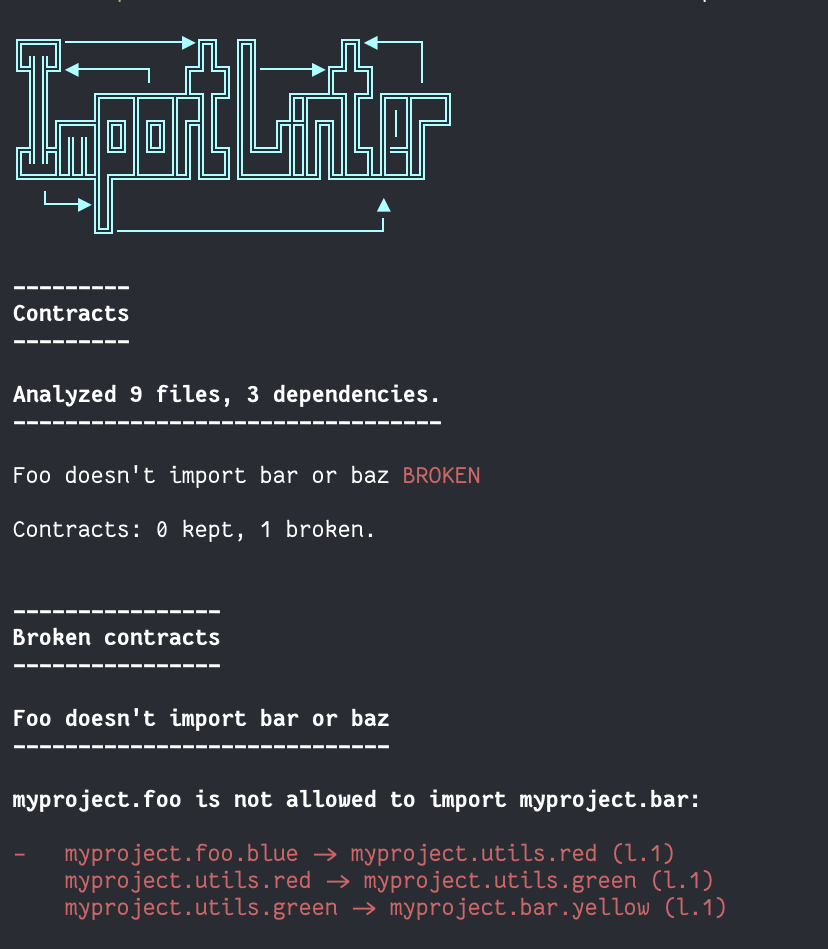

<style>
    .md-content .md-typeset h1 { display: none; }
</style>

{ align: center }
/// caption
Lint your Python architecture.
///
    
<p align="center">
  <a href="https://pypi.org/project/import-linter" target="_blank">
      
  </a>
  <a href="https://pypi.org/project/import-linter" target="_blank">
      
  </a>
  <a href="https://github.com/seddonym/import-linter/actions/workflows/main.yml" target="_blank">
      
  </a>
  <a href="https://opensource.org/licenses/BSD-2-Clause" target="_blank">
      
  </a>
</p>

---

Import Linter is a command line tool to check that you are following a self-imposed
architecture within your Python project. It does this by analysing the imports between all the modules in one
or more Python packages, and compares this against a set of rules that you provide in a configuration file.

The configuration file contains one or more 'contracts'. Each contract has a specific
type, which determines the sort of rules it will apply. For example, the `forbidden`
contract type allows you to check that certain modules or packages are not imported by
parts of your project.

Import Linter is particularly useful if you are working on a complex codebase within a team,
when you want to enforce a particular architectural style. In this case you can add
Import Linter to your deployment pipeline, so that any code that does not follow
the architecture will fail tests.

If there isn't a built-in contract type that fits your desired architecture, you can define
a custom one.

## Quick start

Install `import-linter` using your favorite package manager, e.g.:

```console
pip install import-linter
```

Decide on the dependency flows you wish to check. In this example, we have
decided to make sure that `myproject.foo` has dependencies on neither
`myproject.bar` nor `myproject.baz`, so we will use the `forbidden` contract type.

Create an `.importlinter` file in the root of your project to define your contract(s). In this case:

```ini
[importlinter]
root_package = myproject

[importlinter:contract:1]
name=Foo doesn't import bar or baz
type=forbidden
source_modules=
    myproject.foo
forbidden_modules=
    myproject.bar
    myproject.baz
```

Now, from your project root, run::

```console
lint-imports
```
    

If your code violates the contract, you will see an error message that looks something like this:


